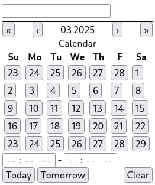

# Date pickle

A Web component for picking date and time.
Built on shoulder of [date-fns](https://date-fns.org/), [@floating-ui](https://floating-ui.com/) and [lit](https://lit.dev/).



## Build

```sh
pnpm build
```

## Demo

```sh
pnpm serve
```

## Usage

```html
<date-pickle></date-pickle>
<!-- <date-pickle range></date-pickle> -->
```

## License

MIT
